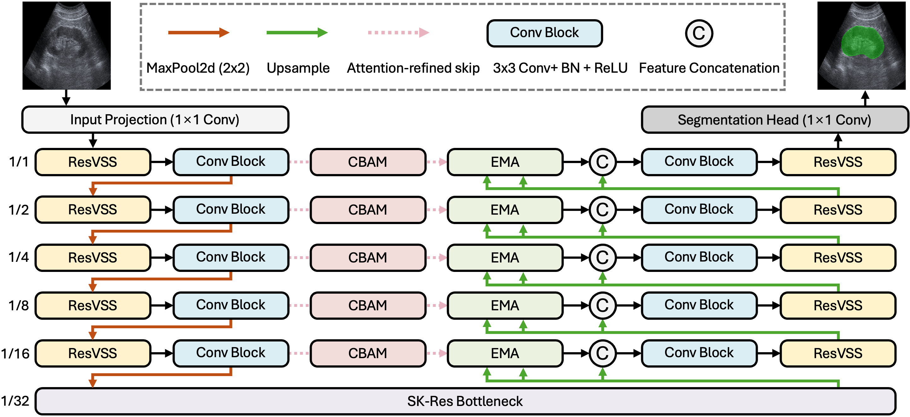

# MambaUS-Net

> **Notice**  
> The manuscript describing **MambaUS-Net** is currently under peer review.  
> Therefore, this repository is made available at the present stage exclusively for the purpose of scholarly manuscript evaluation and is intended for access by reviewers only.

Official implementation of **MambaUS-Net** for ultrasound image segmentation with multi-scale and boundary-aware feature modeling.



## Overview
MambaUS-Net is a deep learning framework for ultrasound image segmentation.  
It is designed to improve anatomical structure modeling in challenging ultrasound images by combining multi-scale feature extraction and boundary-aware feature refinement.

This repository provides the official implementation of the proposed network.

## Repository
GitHub repository:  
https://github.com/zhoujiayi1017/MambaUS-Net/

## Environment
The code was developed and tested under the following environment:

- Miniconda 25.7.0
- Python 3.10
- PyTorch 2.9.0+cu128
- Torchvision 0.24.0
- CUDA Toolkit 12.8.93
- cuDNN 9.10.2

## Installation
Clone the repository and install the required dependencies.

```bash
git clone https://github.com/zhoujiayi1017/MambaUS-Net.git
cd MambaUS-Net
pip install -r requirements.txt
```

Please ensure that your PyTorch, Torchvision, CUDA, and cuDNN versions are mutually compatible in your local environment.

## Project Structure
The current project structure is organized as follows:

```text
MambaUS-Net/
├── models/
│   └── mambaus_net.py          # Network architecture
├── dataset.py                  # Dataset definition and augmentation
├── metrics.py                  # Dice loss and evaluation metrics
├── log.py                      # Metric logging and plotting utilities
├── train.py                    # Training script
├── test.py                     # Inference script
├── requirements.txt            # Python dependencies
├── overall-structure-mambaunet.png
└── README.md
```

## Dataset Preparation
The dataset should be organized in the following format:

```text
dataset_root/
├── train-set/
│   ├── images/
│   └── masks/
├── val-set/
│   ├── images/
│   └── masks/
└── test-set/
    ├── images/
    └── masks/   # optional for inference-only usage
```

For training and validation, each image file should have a corresponding mask file with the same filename.

## Training
To train MambaUS-Net, run:

```bash
python train.py \
  --train_path /path/to/train-set \
  --val_path /path/to/val-set \
  --save_dir ./outputs/experiment_name \
  --epochs 300 \
  --batch_size 8 \
  --base_lr 1e-3 \
  --num_classes 2 \
  --in_channels 3 \
  --ce_w 0.5 \
  --dice_w 0.5 \
  --weight_decay 1e-4 \
  --min_lr 1e-6 \
  --warmup_epochs 10 \
  --warmup_start_factor 0.1 \
  --num_workers 8 \
  --seed 42
```

## Inference
To generate predicted segmentation masks for a test image directory, run:

```bash
python test.py \
  --image_dir /path/to/test-set/images \
  --ckpt_path /path/to/checkpoint.pth \
  --save_dir /path/to/save_predictions \
  --num_classes 2 \
  --in_channels 3 \
  --image_size 256
```

The predicted masks will be saved as `.png` files with the same base filenames as the input images.
